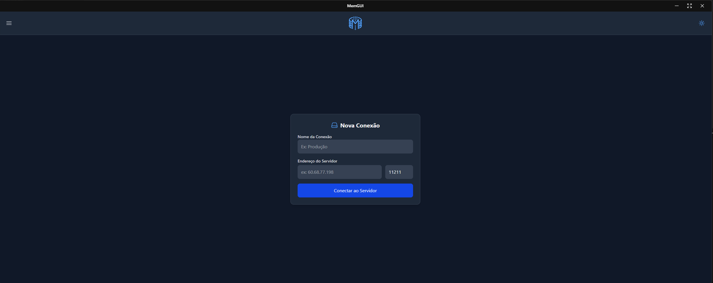
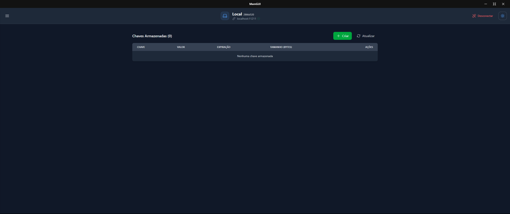
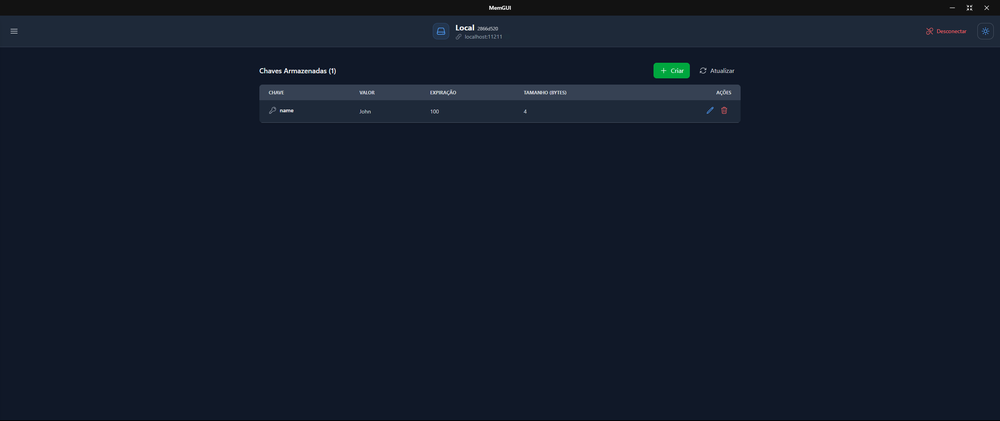
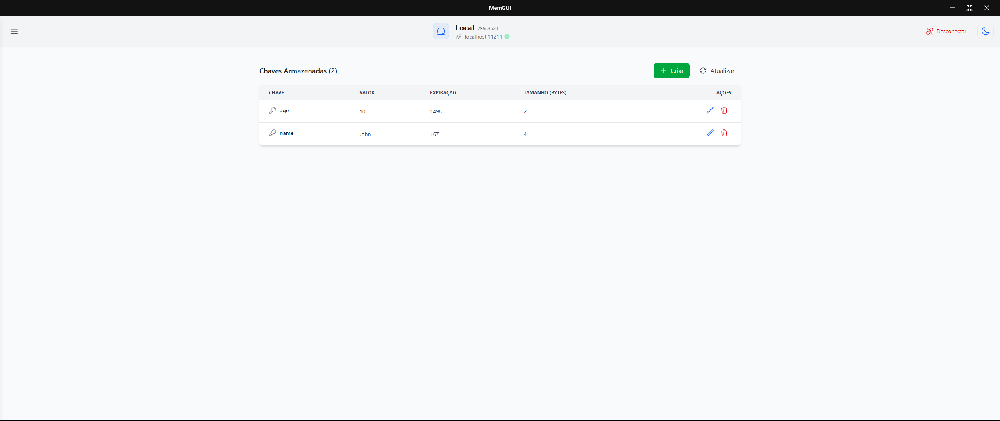
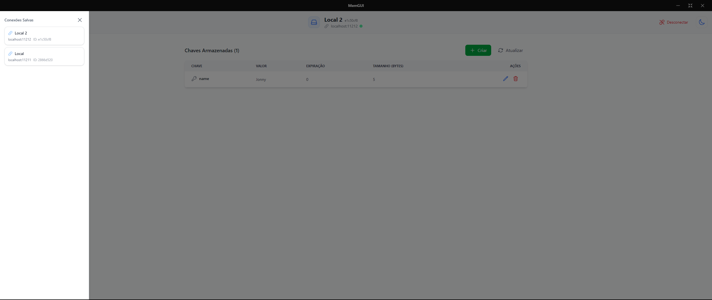

# MemGUI

  

**MemGUI** is a graphical user interface (GUI) for managing **Memcached** databases and cache. It provides an intuitive experience for listing, creating, editing, and deleting keys, overcoming some of Memcached's limitations. It also allows users to view key details such as **content size and TTL** and supports multiple simultaneous connections to different servers.

## 📌 Features

- **Complete Key Management**
  - Create new keys.
  - Edit existing keys (value and expiration time).
  - Delete keys from the cache.
  - View stored keys with details:
    - Key name.
    - Stored value.
    - Expiration time (TTL).
    - Content size.

- **Multi-Server Support**
  - Connect to multiple Memcached instances.
  - Seamlessly switch between active connections without closing them.

- **User-Friendly Interface**
  - Light and dark mode for an enhanced user experience.
  - Simplified navigation for efficient key and server management.

## 🖼 Screenshots

### Connection Screen

### Key List

### Key Creating

### Key Editing

### Switch Connection

## 📜 License

This project is licensed under the **MIT License** - see the [LICENSE](LICENSE) file for details.
